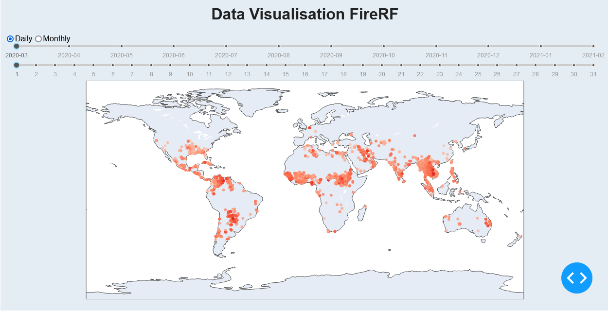
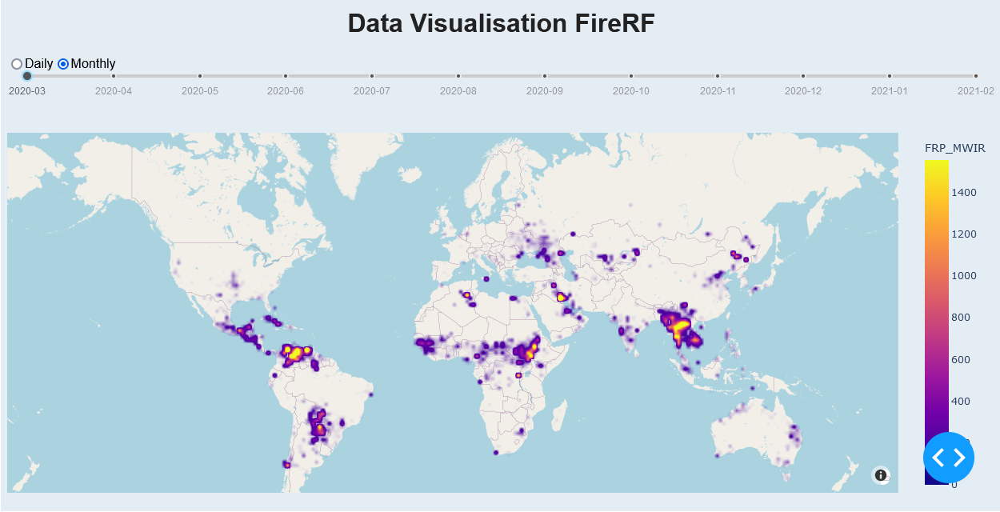
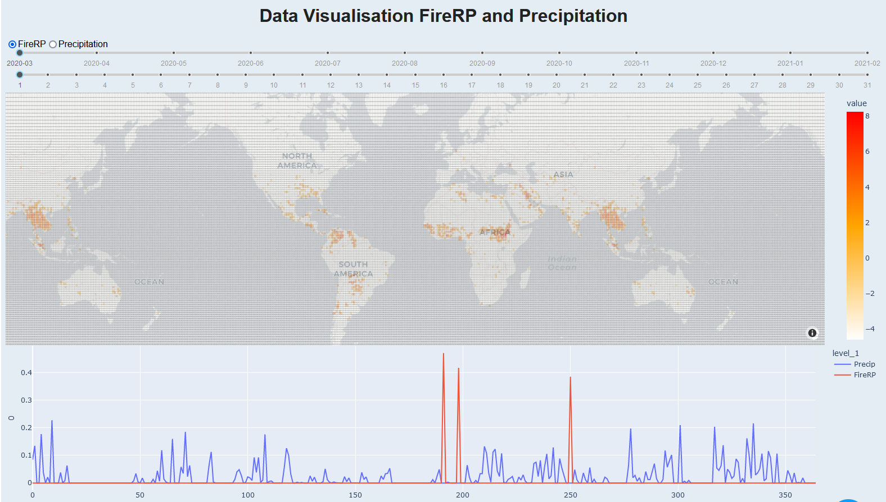
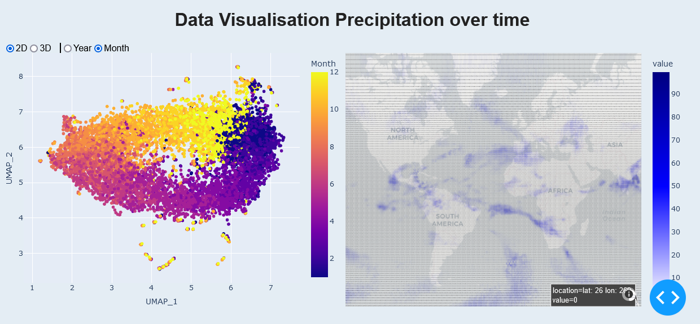
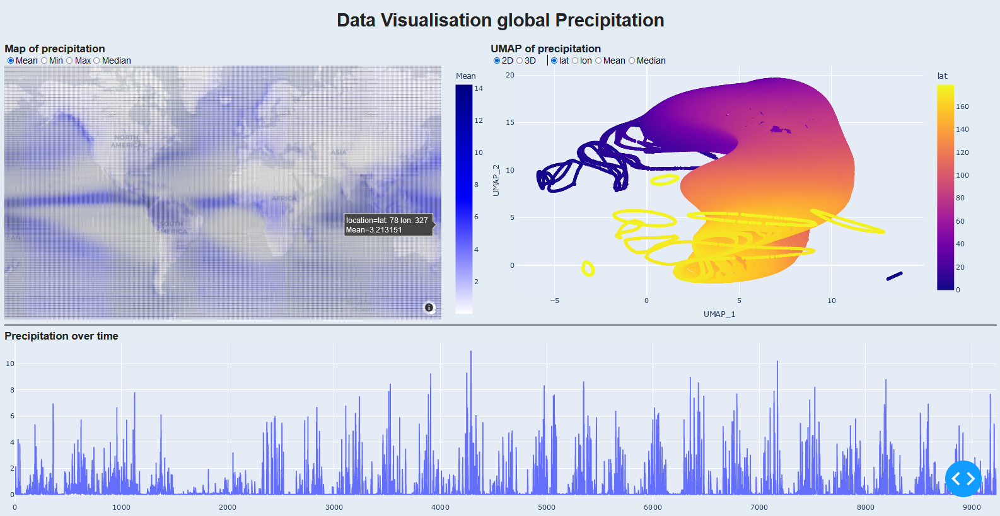
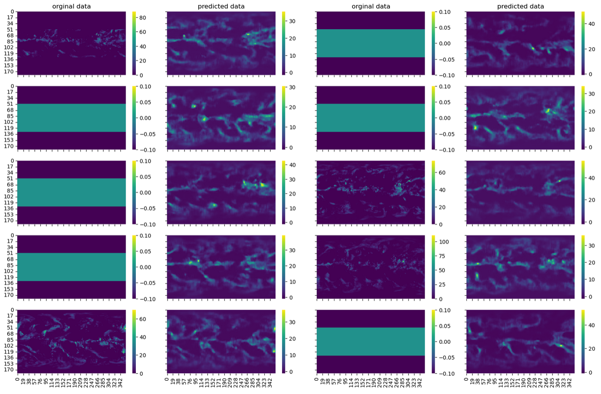

# An Analysis of global Fire Active Pixel and Precipitation from 03.2020 to 02.2021
 

## Content Overview
* [Data Analysis of Fire Reactive Pixels](YC01_LoadData_FireRP.ipynb)
* [Dashboard Visualisation for Fire Reactive Pixels](YC02_Dash_ViewFire.ipynb)
* [Data Analysis of Precipitation Data](YC03_LoadData_Precip_Daily.ipynb)
* [Dashboard Visualisation for Fire Reactive Power and Precipitation](YC08_Dash_ViewData_FireRF_Precip.ipynb)
* [GIF Creation of global FRP and Rain over a year](YC09_CreateGIF_FireRain.ipynb)
* Analysis of the Precipitation Dataset from 1996 to 2022
  1. [Data Cleaning](YC04_PrepData_Precip_ForML.ipynb)
  2. [Dimensionality Reduction with UMAP](YC05_UMAP_Precip_PrepForDash.ipynb)
  3. [Dashboard Visualisation of Precipitation vor Time](YC06_Dash_Precip_time.ipynb)
  4. [Dashboard Visualisaion of global Precipitation](YC07_Dash_Precip_location.ipynb)
* Maschine Learning
  1. Convolutional Autoencoder [Training](ML/ML_CAE_Training_Precip.ipynb), [Prediction](ML/ML_CAE_Predict_Precip.ipynb), [Visualisation](ML/ML_CAE_Visualize_Precip.ipynb), [Model](ML/Models/CNN_AE_vx01.py)
  2. Predictor using CNN: [Training](ML/ML_Pred_Training.ipynb), [Prediction](ML/ML_Pred_Predict.ipynb), [Visualisation](ML/ML_Pred_Visualize.ipynb), [Model](ML/Models/CNN_pred_IIOII_v01.py)
  3. [Complete Model](ML/Models/CNN_comp_IIOII.py): [(Testing)](ML/ML_Comp_Predict.ipynb)
  4. [Variational Convolutional Autoencoder](ML/ML_VCAE_Training.ipynb)
### Dataset used:
* Copernicus Climate Change Service, Climate Data Store, (2021): Fire radiative power and active fire pixels from 2020 to present derived from satellite observation. Copernicus Climate Change Service (C3S) Climate Data Store (CDS). DOI: 10.24381/cds.95afd6ae 
* Copernicus Climate Change Service (2021): Precipitation monthly and daily gridded data from 1979 to present derived from satellite measurement. Copernicus Climate Change Service (C3S) Climate Data Store (CDS). DOI: 10.24381/cds.c14d9324 
### Screenshots
* Dashboard Visualisation for Fire Reactive Pixels \

* Dashboard Visualisation for Fire Reactive Power and Precipitation \

* Dashboard Visualisation of Precipitation vor Time \

* Dashboard Visualisaion of global Precipitation \

* Predicting missing data using CNN \

## Contacts
* LinkedIN: [in/yinshuichang/](https://www.linkedin.com/in/yinshuichang/)
* Email: [yinshui.chang@gmail.com](mailto:yinshui.chang@gmail.com)